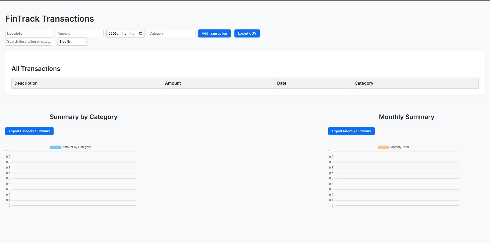

FinTrack – Personal Finance Tracker

FinTrack is a lightweight and intuitive web application built with F#, designed to help users track and visualize their personal spending habits over time.

Motivation

Managing daily expenses is essential, but most people either forget to record them or don't have a tool that's simple enough. FinTrack was created to offer a user-friendly way to record transactions, categorize them, and view meaningful summaries instantly through charts and tables.

Features

- Add, view, and delete transactions (description, amount, date, category)
- Summarized expenses by:
  - Category (e.g. Food, Transport, etc.)
  - Month
  - Weekly
- CSV export of summaries
- Filter by search text and date range
- Visual data summaries via charts (Chart.js)
- Responsive design

Try it live

[Live Demo on GitHub Pages](https://github.com/Deryckboiii/fintrack)  

Screenshots

Dashboard



Technologies Used

- **F#** (.NET 7)
- **Giraffe** – functional web framework
- **SQLite** – lightweight embedded database
- **Chart.js** – data visualization
- **HTML + JS + CSS** – frontend
- **GitHub Pages / Render** – deployment

How to run locally

Prerequisites
- [.NET SDK 7.0+](https://dotnet.microsoft.com/en-us/download)
- Node.js (for chart building, if needed)
Running the app

```bash
dotnet restore
dotnet run